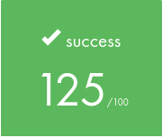
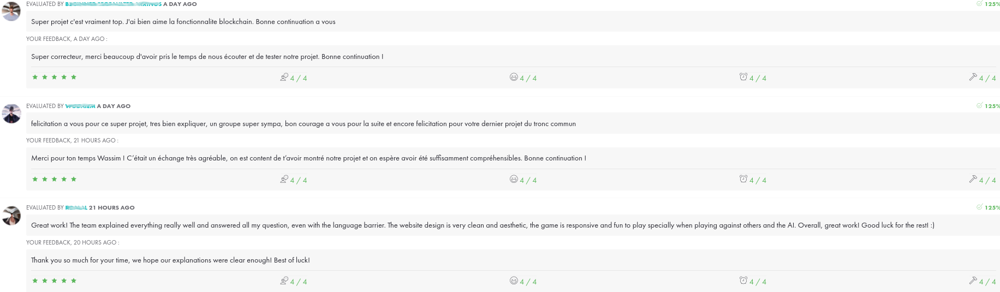
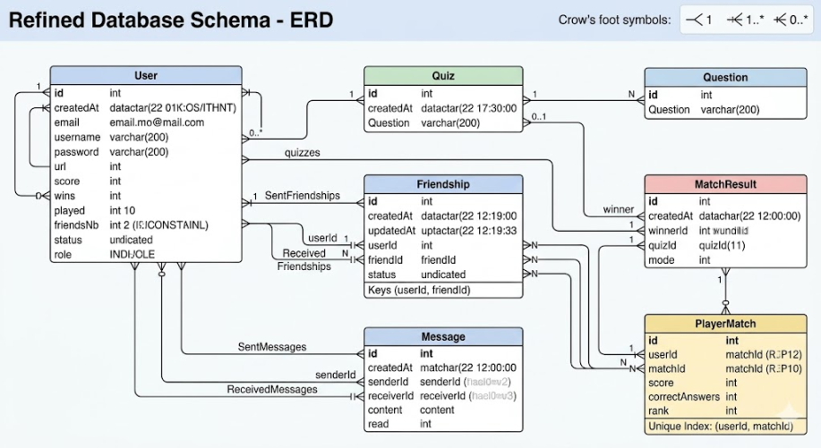

*This project has been created in June 2026 as part of the 42 curriculum by jmen, alandel, ikayiban, and tclouet.*





# Description

*This section presents the project, its goals and a brief overview*

ft_transcendence is a group project designed to stimulate students' creativity, adaptability to new technologies, and teamwork skills.

The choice of application type remains at the team's discretion, as long as it adheres to the technical modules outlined in the project brief.

Our team chose to develop 42Brain: an online multiplayer quiz application that allows users to authenticate, practice, compete, and interact with one another in real time.

# Instructions

*This section contains information about compilation, installation, and/or execution.*

*Before starting, please ensure that Docker Engine and the latest version of Google Chrome are installed.*


1. ### **At the root of the project, open the `env_template` file and fill in these variables with your own values:**
	
	- `POSTGRES_USER`: your database username.
	- `POSTGRES_PASSWORD`: your database user password.
	- `ADMIN_EMAIL`: your Prisma admin email address.
	- `ADMIN_PASSWORD`: your Prisma admin password.
	- `JWT_SECRET`: your JWT secret key.
	- `CHAIN_PRIVATE_KEY` : your wallet private key.


#### Note:
	- You can use a random key generator to generate a value for JWT_SECRET.
	- Rename the file to `.env` once all the values ​​have been entered.

2. ### **Build and run the services**

	Open a terminal.

	Run `docker compose up --build` to buil all services and run the application.


3. ### **Once all services are running, the application will be available at:**

	https://localhost:8888/  

#### Note:
	The application uses a self-signed SSL certificate, so your browser may display a security warning.


4. ### **Stop and clean up**

	Press `CTRL+C` to stop the running containers.  
	Then, use `docker compose down --volumes --rmi all` to remove the application.

#### Note:
	This command removes all containers, images, and volumes for this project only.


# Resources

*This section lists references related to the topic, as well as a description of how AI has been used.*

- [Learn about PostgreSQL.](https://www.postgresql.org/docs/)
- [Learn about Prisma ORM.](https://www.prisma.io/docs)
- [Learn about Express.js.](https://expressjs.com/fr/)
- [Learn about Redis.](https://redis.io/docs/latest/)
- [Learn about ZOD.](https://zod.dev/)
- [Learn about SvelteKit.](https://svelte.dev/docs/kit/introduction)
- [Learn about TailwindCSS.](https://v2.tailwindcss.com/docs)
- [Learn about TypeScript.](https://www.typescriptlang.org/fr/docs/handbook/typescript-from-scratch.html)
- [Learn about HTML/CSS.](https://www.w3.org/Style/Examples/011/firstcss.fr.html)
- [Learn about HTTP requests.](https://developer.mozilla.org/fr/docs/Web/HTTP/Reference/Methods)
- [Learn about WebSockets.](https://developer.mozilla.org/en-US/docs/Web/API/WebSockets_API)


#### **Use of AI**  

AI was used to support the understanding of new frameworks and concepts introduced in this project. Specifically, it helped with:

- Express.js: understanding how to structure API routes, implement and chain middleware (authentication, validation, error handling), and manage request/response cycles.

- SvelteKit: understanding the routing system (file-based routing, layouts, route guards), and how to use reactive stores for managing shared application state across components.

- Debugging: interpreting error logs and stack traces during the testing phase, particularly for WebSocket connection issues.

# Team Information

*This section describes the role and responsibilities of each team member.*

### jmen

Technical Lead / Architect: Oversees technical decisions and architecture.

- Defines technical architecture.
- Makes technology stack decisions.
- Ensures code quality and best practices.
- Reviews critical code changes.

### alandel

Technical Lead support: Supports the Technical Lead in architectural and technical decisions.

Mainly responsible for the development of the game modes (solo, remote multiplayer, and tournament) and the blockchain feature.

- Implements the solo, multiplayer, and tournament game logic.
- Handles real-time gameplay synchronization between players.
- Implements the blockchain integration for storing tournament results.

### ikayiban

Product Owner (PO): Defines the product vision, prioritizes features, and ensures the project meets user needs.

- Maintains the product backlog.
- Makes decisions on features and priorities.
- Validates completed work.
- Communicates with stakeholders (evaluators, peers).


### tclouet

Project Manager (PM) / Scrum Master: Facilitates team coordination and removes obstacles.

- Organizes team meetings and planning sessions.
- Tracks progress and deadlines.
- Ensures team communication.
- Manages risks and blockers.

### All team members

Developers: Implement features and modules.

- Write code for assigned features.
- Participate in code reviews.
- Test their implementations.
- Document their work


# Project Management

*This section explains how the team organized the work and what tools were used for project management and communication.*

The project was organized through a clear distribution of tasks once the project idea had been validated.


* **jmen** was responsible for the backend development, including the REST API, WebSocket communication, data validation, and Redis integration.

* **alandel** developed the game logic, including the solo, remote multiplayer, and tournament modes. He also implemented the Blockchain part.

* **ikayiban** implemented the database layer, the ORM integration, and the AI game mode along with its underlying algorithm.

* **tclouet** designed the website, defined its overall structure, and implemented the user profiles, the chat, and friendship systems.


To ensure smooth collaboration, the team held weekly meetings to discuss progress, address technical challenges, and plan upcoming milestones. In addition, a dedicated Discord server was used for daily communication, allowing team members to coordinate their work and quickly resolve issues.

Project specifications, task assignments, and development notes were documented in a shared Markdown file stored within the project repository, providing a centralized source of information for the entire team.

GitHub Issues was briefly tested at the beginning of the project as a project management tool. However, due to the team's size and the effectiveness of direct communication, regular discussions and weekly meetings proved sufficient for tracking progress and coordinating development efforts.

GitHub Actions was used to automatically verify code changes submitted to both personal development branches and the main branch. This helped ensure code quality, detect potential issues early, and maintain a stable codebase throughout the project.

# Technical Stack

*This section details the technologies used for each part of the project.*

### Frontend
- SvelteKit for building the user interface and managing application routing.
- Tailwind CSS for responsive and maintainable styling.
- Socket.IO and HTTP requests for communication with the backend and live notifications.
- Zod for client-side data validation and type-safe schema definitions.

**Why SvelteKit?**

SvelteKit was chosen for its simplicity and performance. Its component-based architecture and built-in routing system allow rapid development while keeping the codebase clean and maintainable.

### Backend

- Node.js and Express.js for the server application.
- REST API for standard client-server interactions.
- Socket.IO for real-time features such as matchmaking and game state synchronization.
- Zod for runtime validation of incoming data.

**Why this backend stack?**

Node.js provides an event-driven, non-blocking architecture that is particularly well suited for real-time applications and handling multiple concurrent connections. Express.js offers a lightweight and flexible framework that simplifies API development through its routing and middleware system. Combined with Socket.IO and Zod, this stack enables efficient real-time communication while ensuring data consistency and validation.

### Database
- PostgreSQL as the primary relational database.
- Prisma ORM for type-safe database access and schema management.

**Why PostgreSQL?**

PostgreSQL was chosen because it is a reliable and efficient solution, while also offering the opportunity to gain experience with a technology commonly used in professional environments.

**Why Prisma ORM?**

Prisma was chosen for its simplicity and schema-based approach to defining data models. Its single schema file centralizes database structure and relationships, making the project easier to understand and maintain.

### Other technologies
- TypeScript for end-to-end type safety across the frontend and backend
- Redis for caching and temporary storage of real-time data such as active sessions and game states.
- Avalanche blockchain integration using Solidity smart contracts for decentralized features and blockchain-based interactions.

**Why TypeScript?**

TypeScript was used throughout the project to improve code reliability, maintainability, and developer productivity. Shared type definitions between the frontend and backend help reduce inconsistencies and catch errors at compile time.

**Why Redis?**

Redis provides fast in-memory data storage, making it ideal for caching frequently accessed data. It improves the responsiveness of the web application while reducing the load on the main database.

**Blockchain : deploying your own contract from scratch (optional)**
  
  If you want a fresh contract with no history:
  
  1. Add your deployer wallet's private key to `blockchain/.env`:
     DEPLOYER_PRIVATE_KEY=0x...  
  2. Make sure the wallet has testnet AVAX (faucet:
  https://faucet.avax.network/)  
  3. Deploy:
  ```bash
  cd blockchain && npm install
  npx hardhat run scripts/deploy.ts --network fuji
```  
  4. Copy the printed address into the root .env:  
 	 CHAIN_CONTRACT_ADDRESS=0x<new_address>  
 	 CHAIN_PRIVATE_KEY=0x<same_deployer_key>  
  5. Restart the backend.

# Database Schema

*This section outlines the database structure.*




# Features List

*This section summarizes the implemented features, a brief description of each, and the team members involved.*

### Authentication system

- **Register / Login with email and password**  
Allows users to create an account and authenticate using email credentials.  
*Implemented by: jmen, ikayiban, tclouet*
- **Logout**  
Securely terminates the user session.  
*Implemented by: jmen, ikayiban, tclouet*

### User Management

- **Personnal profile management**  
Users can view and edit their profile information.  
*Implemented by: ikayiban, tclouet*
- **Notifications system**  
Users receive notifications for actions.  
*Implemented by: tclouet*

### Game system

- **Answering questions**  
Users can participate in quizzes by selecting answers in real time.  
*Implemented by: jmen, alandel, ikayiban*
- **Scoring system**  
Computes and updates user scores based on quiz performance.  
*Implemented by: jmen, alandel, ikayiban*
- **Matchmaking**  
Automatically pairs players for a game session.  
*Implemented by: jmen, alandel*
- **Real-time gameplay**  
Enables live multiplayer interactions with synchronized game state.  
*Implemented by: jmen, alandel*
- **Game modes (solo, versus AI, multiplayer, tournament)**  
Supports different gameplay modes depending on user choice.  
*Implemented by: jmen, alandel, ikayiban, tclouet*

### Social features
- **Friend requests**  
Users can send friend requests to others.  
*Implemented by: jmen, ikayiban, tclouet*
- **Friend request management (accept/reject)**  
Users can manage incoming friend requests.  
*Implemented by: jmen, ikayiban, tclouet*
- **Friends list**  
Displays the list of accepted friends.  
*Implemented by: jmen, ikayiban, tclouet*
- **Notifications system**  
Users receive notifications for social interactions (friend requests, etc.).  
*Implemented by: tclouet*
- **User profiles**  
Public profile pages displaying user information and stats.  
*Implemented by: ikayiban, tclouet*

### Chat system
- **Private messaging**  
Users can exchange direct messages in real time.  
*Implemented by: jmen, ikayiban, tclouet*
- **Read / unread status**  
Tracks whether messages have been seen by the recipient.  
*Implemented by: jmen, ikayiban, tclouet*


# Modules

*This section covers the selected modules, their implementation, associated point values, and the team members involved.*

## Major modules (2 points each):

### - Use a framework for both the frontend and backend.  

**Why?**  

We chose to use frameworks to speed up development, structure the project properly, and handle complexity more easily, especially for real-time features and routing.  

**How?**  

The frontend was built with SvelteKit, which provides routing and a component-based architecture. The backend was built with Express.js, which was used to create a REST API and integrate WebSocket communication.  

*Implemented by: jmen, tclouet*

### - Implement real-time features using WebSockets or similar technology.  

**Why?**  

We chose WebSockets to enable real-time communication between users, which is essential for multiplayer gameplay, chat, and notifications.

**How?**  

It was implemented using Socket.IO on the backend and integrated into the frontend to handle game state updates, chat messages, and notifications in real time.  

*Implemented by: jmen, alandel, tclouet*

### - Allow users to interact with other users.  

**Why?**  

User interaction is a core part of the application, enabling social engagement beyond gameplay.  

**How?**  

We implemented features such as friend requests, private messaging, and user profiles, allowing users to connect and interact inside the platform.  

*Implemented by: jmen, ikayiban, tclouet*

### - Standard user management and authentication.  

**Why?**  

Authentication is required to secure user data and allow personalized features such as profiles, game history, and social interactions.  

**How?**  

We implemented email/password authentication. JWT tokens are used to manage sessions and protect API routes.  

*Implemented by: jmen, ikayiban, tclouet*

### - Introduce an AI Opponent for games.  

**Why?**  

We implemented an AI opponent to allow users to play without needing another player.  

**How?**  

The AI uses a rule-based decision system adapted to quiz gameplay to simulate realistic answers.  

*Implemented by: ikayiban, tclouet*

### - Implement a complete web-based game where users can play against each other.  

**Why?**  

The core objective of the project is to provide an interactive multiplayer game experience accessible through the web.  

**How?**  

We developed a real-time quiz game where players answer questions and compete against each other. The game logic is handled on the backend and synchronized with clients using WebSockets.  

*Implemented by: jmen, alandel, ikayiban, tclouet*

### - Remote players — Enable two players on separate computers to play the same game in real-time.  

**Why?**  

To support multiplayer gameplay across different devices and locations.  

**How?**  

We used WebSockets to synchronize game state between clients and the server, ensuring both players receive updates in real time during matches.  

*Implemented by: jmen, alandel, tclouet*

### - Multiplayer game (more than two players).  

**Why?**  

To extend gameplay beyond 1v1 matches and increase competition dynamics.  

**How?**  

We implemented a multiplayer mode where multiple users can participate in the same session, with centralized game state management on the server.  

*Implemented by: jmen, alandel, tclouet*

### - Store tournament scores on the Blockchain.  

**Why?**  

We used blockchain technology to store tournament results in a decentralized and tamper-proof way.  

**How?**  

Smart contracts were deployed to record final scores after tournament completion.  

*Implemented by: alandel*

## Minor modules (1 point each) :

### - Use an ORM for the database.  

**Why?**  

We used Prisma ORM to simplify database interactions and ensure type-safe access to the PostgreSQL database.  

**How?**  

It was used to define the schema, manage migrations, and perform queries for users, friendships, messages, and game data.  

*Implemented by: ikayiban*

### - A complete notification system for all creation, update, and deletion actions.  

**Why?**  

To improve user experience by providing real-time feedback on social and system events.  

**How?**  

We implemented frontend notifications using showToast to display real-time feedback when events occur (e.g. friend requests, messages, and other user actions).  

*Implemented by: tclouet*

### - Implement a tournament system.  

**Why?**  

To structure competitive gameplay and provide a progression system beyond single matches.  

**How?**  

We implemented a tournament flow where players compete in multiple rounds, with results tracked and processed server-side.  

*Implemented by: jmen, alandel, tclouet*


`TOTAL: 9 major modules + 4 minor modules = 18 + 3 = 21/14 points`

# Individual Contributions

*This section highlights each team member’s contributions*

## jmen

- Developed the backend architecture of the application, including the REST API using Express.js and real-time communication using Socket.IO.

- Implemented session handling, and JWT-based security.

- Integrated Redis for caching and managing real-time game/session state.

- Implemented server-side validation using Zod to ensure data consistency and prevent invalid requests.

- Acted as technical lead for backend design decisions and global API structure.

**Challenges faced:**

- Managing real-time synchronization between multiple players in fast-paced game sessions.

- Ensuring consistency between REST API state and WebSocket state.

- Handling authentication edge cases (token refresh, session expiration, OAuth callback reliability).

**Solutions:**

- Introduced a clear separation between HTTP and WebSocket layers.

- Centralized state management for game sessions using Redis.

- Added strict validation layers and defensive backend patterns to avoid inconsistent states.


## alandel

- Developed the three game modes — solo, remote multiplayer, and tournament — both their game logic and their pages (lobby, in-game, results, and bracket).

- Implemented matchmaking and the full tournament flow: 4-player brackets with semi-finals, a final, rankings, and a spectator view for eliminated players.

- Made gameplay reliable in real time, so players stay in sync and a brief network drop never kicks someone out of a match.

- Integrated the blockchain feature that records final tournament scores on the Avalanche network.

**Challenges faced:**

- Keeping players in sync during fast-paced rounds.

- Preventing network drops from eliminating a player or breaking a tournament mid-way.

- Recording scores on the blockchain without slowing down the game.

**Solutions:**

- Made the server the single source of truth for the game state, so a lost or late event self-heals instead of freezing the match.

- Kept tournament players connected through reconnections and removed disconnection-based forfeits.

- Wrote scores to the blockchain in the background, so a slow transaction never affects the game.


## ikayiban

- Designed and implemented the database schema using PostgreSQL and Prisma ORM.

- Developed the AI opponent system, including decision-making logic for quiz gameplay.

- Managed data modeling for users, scores, friendships, and game sessions.

- Contributed to backend integration by ensuring consistent data flow between services.

**Challenges faced:**

- Structuring a scalable schema capable of supporting social features and real-time gameplay.

- Designing an AI system that provides a balanced and engaging difficulty level.

**Solutions:**

- Refined the Prisma schema based on the evolution of functionalities.

- Implemented AI logic with adjustable difficulty parameters.


## tclouet

- Designed and implemented the frontend structure using SvelteKit and Tailwind CSS.

- Implemented route protection using JWT validation to restrict access to authenticated users.

- Developed the social features including user profiles, friend requests, messaging, and notifications.

- Built the chat system with real-time messaging.

**Challenges faced:**

- Managing real-time UI updates without causing state inconsistencies.

- Designing a scalable frontend architecture for multiple features (chat, game, social).

- Handling synchronization between frontend state and backend events.

**Solutions:**

- Used SvelteKit reactive stores to manage application state.

- Standardized WebSocket event handling across the frontend.
